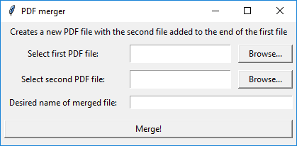
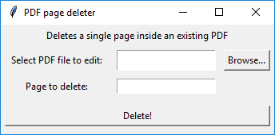

# PDF_Merge_and_Edit
Python script to merge and edit sensitive PDF files you don't want to upload to random sites you find on Google


**Needs PyPDF2 module installed on machine to work**

If you have Python installed correctly with the correct environment variables install PyPDF2 by typing this into your command line:
```
pip install PyPDF2
```
**Features**:

* Merge PDFs by adding one to another
* Update a single page in a PDF (good for adding a signature to a form)
* Insert a page into an existing PDF
* Delete a page

**How to use**

1. Run the script or .pyw file


2. Click on one of the buttons and a new window will pop up depending on the function






3. Pick your files and enter in the data

4. If there are no problems, a confirmation will pop up


